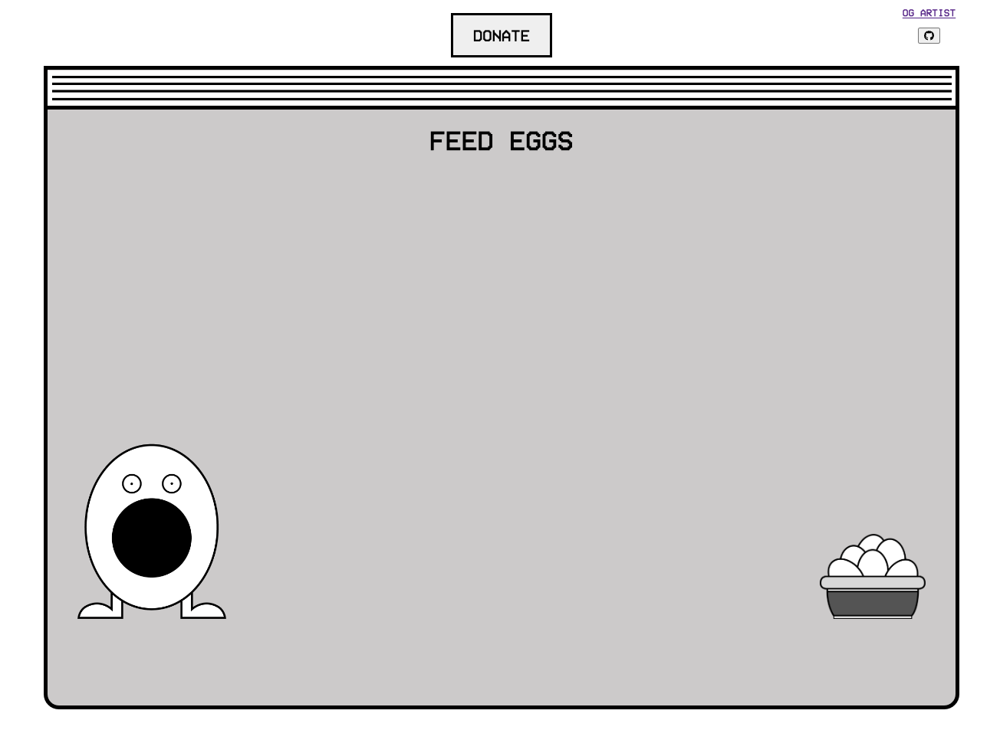

# Egg Game!

This project was created in an attempt to open source the original [EGG GAME](https://egggame.org/) app. I blatently ripped off the `css`, animations, and all the image assets from the original `EGG GAME` website, and only implemented the gameplay logic myself using [VueJS](https://vuejs.org/). All credit for the artwork and animations goes to [Alec Land](https://alec.land/).

As a huge fan of [I think You Should Leave](https://www.netflix.com/title/80986854), I created this app just for a fun challenge to try and implement the game myself. The aim is not to replace or reinvent the wheel for the original Egg Game app, but rather just to try and open source it.  

I have also make my own tweaks to some of the logic. This version does not randomly popup Egg messages at random intervals, but rather on random number generators when an egg was eaten. This version is also a little more predictible and easier to win.

### Live Version

The live version of this app can be played here:

[https://calebm1987.github.io/egg-game-live/](https://calebm1987.github.io/egg-game-live/)



## Original Sketch

<iframe width="560" height="315" src="https://www.youtube.com/embed/K0OSfbPJFa4" title="YouTube video player" frameborder="0" allow="accelerometer; autoplay; clipboard-write; encrypted-media; gyroscope; picture-in-picture; web-share" allowfullscreen></iframe>

### Developer tools

This app uses the [debug]() package to provide log information. To view the dev logs, go to your browser console and type:

```js
localStorage.debug = 'egg-game'
```

This will show the game logs. There is also a convenience method to allow a user to override the default range for the random number generator for when you win, allowing you to win much quicker.  This can be set by doing the following in the console:

```js
localStorage.setItem('egg-game', JSON.stringify({ min: 5, max: 11 }))
```

The above example will ensure you get to the `Dude, you ran out of eggs...` message within 5-10 clicks (non-inclusive range).

There are also some Easter "eggs" available in the dev tools...

# Vue 3 + TypeScript + Vite

This template should help get you started developing with Vue 3 and TypeScript in Vite. The template uses Vue 3 `<script setup>` SFCs, check out the [script setup docs](https://v3.vuejs.org/api/sfc-script-setup.html#sfc-script-setup) to learn more.

## Recommended IDE Setup

- [VS Code](https://code.visualstudio.com/) + [Volar](https://marketplace.visualstudio.com/items?itemName=Vue.volar) (and disable Vetur) + [TypeScript Vue Plugin (Volar)](https://marketplace.visualstudio.com/items?itemName=Vue.vscode-typescript-vue-plugin).

## Type Support For `.vue` Imports in TS

TypeScript cannot handle type information for `.vue` imports by default, so we replace the `tsc` CLI with `vue-tsc` for type checking. In editors, we need [TypeScript Vue Plugin (Volar)](https://marketplace.visualstudio.com/items?itemName=Vue.vscode-typescript-vue-plugin) to make the TypeScript language service aware of `.vue` types.

If the standalone TypeScript plugin doesn't feel fast enough to you, Volar has also implemented a [Take Over Mode](https://github.com/johnsoncodehk/volar/discussions/471#discussioncomment-1361669) that is more performant. You can enable it by the following steps:

1. Disable the built-in TypeScript Extension
   1. Run `Extensions: Show Built-in Extensions` from VSCode's command palette
   2. Find `TypeScript and JavaScript Language Features`, right click and select `Disable (Workspace)`
2. Reload the VSCode window by running `Developer: Reload Window` from the command palette.
